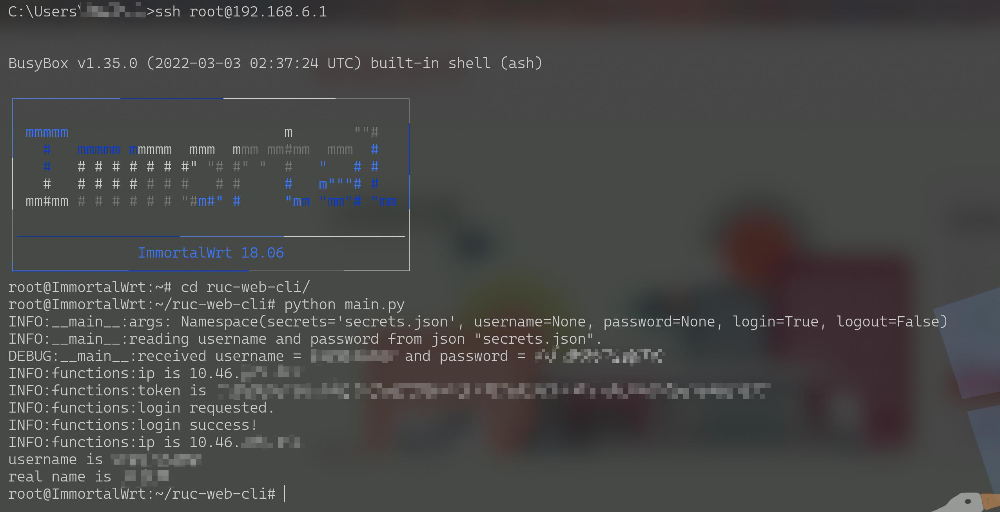

# RUC Web CLI

Command line interface for login/logout campus network of RUC, Renmin University of China, where gateway is developed by Shenlan Tech co.,ltd since 2020. 

This document is written on Sept 17th 2022.

This tool **does NOT need any third-party librarys, just pure python3 interpreter**, since you may run without(before) you have any internet connection. Actually, i run this tool on my router, whose OS is OpenWRT and arch is ARM, it works pefectly well.

## 0x00 Any Gateway Develeoped byShenlan Tech co.,ltd Can Have A Try

Yes. As long as your school uses gateway developed by Shenlan Tech co.,ltd, you can have a try. 

You simply need to change `BASE_URL` in `functions.py`.

## 0x01 Why Another CLI Tool for RUC Network Control

As you may searched on github by keywords like `ruc login`, you may discover that there were already a few repositories. But RUC has built a new gateway in 2020, so any tool developed before that are deprecated. 

I find a repository after that time but, it was implemented by simulating human actions in browsers, i.e. Selenium. Which is so heavy and lack of portability.

But the procedure is **way more complicated** than just GET/POST some arguments, thanks to Shenlan Tech co.,ltd. If you want to know more about how it works, read references below.

By the way, you may guess mobile login page may be easier. But from my observation, there is no difference between mobile and PC login logic.

## 0x02 Usage

Example 1: login with username and password
`python main.py --username YOUR_USERNAME --password YOUR_PASSWORD --login`

by default, `--login` is true, so `--login` can be omitted.
`python main.py --username YOUR_USERNAME --password YOUR_PASSWORD`

Example 2: login with json file
`python main.py --secrets YOUR_USERNAME_AND_PASSWORD_JSON_FILENAME --login`

by default, `--secrets` uses `./secrets.json`. if you follow this manner, just run
`python main.py`

## 0x03 References

- Protocol analysis, RUC is slightly different: https://blog.csdn.net/qq_41797946/article/details/89417722
- Referenced implementation: https://github.com/huxiaofan1223/jxnu_srun

## 0x04 Third Party Code Declaration

- `./encryptions` are encryptions used in login and logout, include `base64, md5, sha1, xencode`.
Note the implementation of Shenlan Tech co.,ltd may NOT be common, i.e. other implementations with the same  method name may NOT work.
`./encryptions` were translated from login page javascript into python, thanks to https://github.com/huxiaofan1223/jxnu_srun.